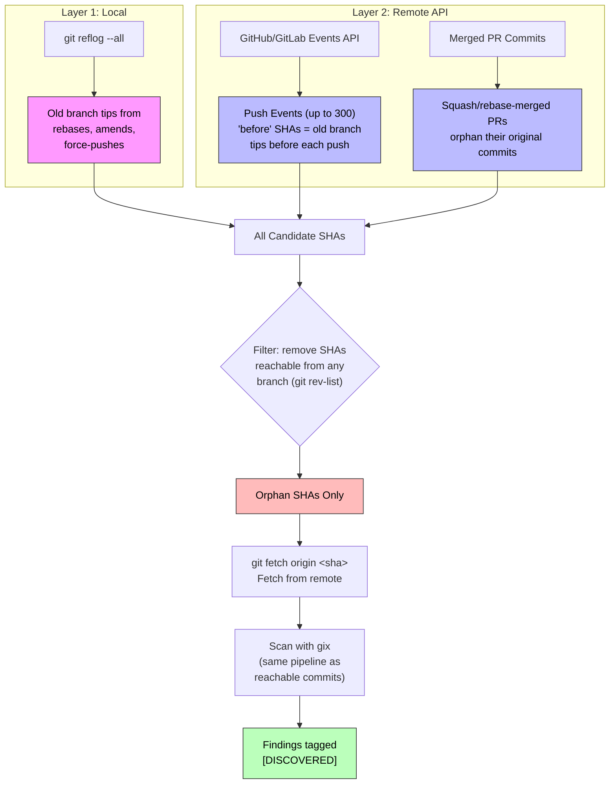

# git-leaks

A fast Rust CLI tool that scans git commit history for leaked secrets in file contents. Built with [gix](https://github.com/GitoxideLabs/gitoxide) (gitoxide) for native git traversal, [rayon](https://github.com/rayon-rs/rayon) for parallel processing, and Rust's [regex](https://github.com/rust-lang/regex) crate for high-performance pattern matching.

## Features

- Scans **all git history** by default (customizable with `--since`)
- Searches **file contents** in every commit, not just commit messages
- Detects EVM private keys, AWS credentials, API keys, PEM keys, passwords/tokens
- Scans **dangling commits** (post-rebase/amend, pre-GC) with `--dangling`
- **Auto-discovers orphan commits** from GitHub/GitLab API + local reflog with `--discover-orphans`
- Fetches **specific orphan commits** by SHA from remote with `--fetch-orphans`
- **Cryptographic validation** of EVM private keys via secp256k1 curve (k256)
- `--private-keys-only` to filter to just private key patterns
- `--reveal` for partial secret display (first 5 + last 5 chars)
- **AES-256-GCM encrypted output** with `--output` (password-protected, full secrets inside)
- Uses `gh` CLI for GitHub API auth (SSH keys / OAuth) — no token env vars needed
- Parallel commit processing across CPU cores
- Human-readable and JSON output formats
- Exit code 1 when secrets found (CI-friendly)

## Installation

```bash
cargo build --release
# Binary at: target/release/git-leaks
```

## Usage

```bash
# Scan current repo (all history, HEAD branch)
git-leaks

# Scan a specific repo, all branches
git-leaks --repo /path/to/repo --all-branches

# Limit to recent history
git-leaks --since "4 months ago"

# Full paranoid scan — reachable + dangling + auto-discovered orphans
git-leaks --all-branches --dangling --discover-orphans --max-file-size 5242880

# Fetch and scan specific orphan commits by SHA
git-leaks --fetch-orphans "d8764a93,abc12345"

# Only scan for private keys (EVM, hex, PEM)
git-leaks --private-keys-only --reveal

# Write findings to AES-encrypted file (prompts for password)
git-leaks --output findings.enc --reveal

# Decrypt and read the findings later
git-leaks --decrypt findings.enc

# JSON output for piping
git-leaks --format json

# Only scan specific file types
git-leaks --extensions "js,ts,py,env,json"

# GitHub auth via gh CLI (uses SSH keys automatically)
# Or set token manually for private repos:
export GITHUB_TOKEN=ghp_xxxxx
git-leaks --discover-orphans
```

## Options

| Flag | Description | Default |
|------|-------------|---------|
| `-r, --repo <PATH>` | Path to the git repository | `.` |
| `--since <DATE>` | Only scan commits after date (e.g. `"4 months ago"`, `"2024-01-01"`) | all history |
| `--format <human\|json>` | Output format | `human` |
| `--extensions <ext,ext>` | Only scan files with these extensions | all files |
| `--max-file-size <BYTES>` | Skip blobs larger than this | `10485760` (10MB) |
| `--all-branches` | Scan all branches, not just HEAD | off |
| `--dangling` | Scan unreachable commits (via `git fsck`) | off |
| `--fetch-orphans <SHAs>` | Fetch and scan specific orphan commit SHAs from remote | - |
| `--discover-orphans` | Auto-discover orphans from API + reflog | off |
| `--private-keys-only` | Only scan for private key patterns (EVM, hex, PEM) | off |
| `--reveal` | Show partial secret (first 5 + last 5 chars) | off (fully redacted) |
| `-o, --output <FILE>` | Write findings to AES-256-GCM encrypted file | - |
| `--decrypt <FILE>` | Decrypt and print a previously encrypted output file | - |

## How Orphan Discovery Works

Commits that were force-pushed away, squash-merged, or rebased off a branch are invisible to normal `git log`. GitHub/GitLab never garbage-collect these objects — they remain fetchable by SHA indefinitely. `--discover-orphans` finds them automatically:



## Default Secret Patterns

| Pattern | What it catches |
|---------|----------------|
| `evm_private_key` | `privateKey: '0x' + 64 hex chars` with assignment context |
| `hex_private_key_raw` | Same without `0x` prefix |
| `aws_access_key` | `AKIA/ABIA/ACCA/ASIA` + 16 chars |
| `aws_secret_key` | AWS secret access key assignments |
| `generic_api_key` | `api_key`/`apikey` assignments (20+ chars) |
| `generic_secret` | Quoted `secret`/`password`/`token` values (8+ chars) |
| `pem_private_key` | `-----BEGIN ... PRIVATE KEY-----` headers |

All patterns require assignment context (`:`, `=`) to reduce false positives. Handles both quoted (`'key': 'value'`) and unquoted formats.

## Architecture

```
src/
├── main.rs        # Entry point, orchestration
├── cli.rs         # CLI argument definitions (clap)
├── scanner.rs     # Core: commit walking, tree traversal, blob scanning
├── patterns.rs    # Secret detection regex patterns
├── finding.rs     # Finding struct + deduplication
├── output.rs      # Human-readable + JSON formatters
├── orphans.rs     # Orphan commit auto-discovery (API + reflog)
├── validate.rs    # secp256k1 private key cryptographic validation
└── crypto.rs      # AES-256-GCM encrypted output (PBKDF2 key derivation)
```

**Key dependencies:**
- `gix` (gitoxide) — native Rust git traversal, no `git` binary needed for core scanning
- `regex` — ~600x faster than Go's `regexp` for pattern matching
- `rayon` — data-parallel commit processing across CPU cores
- `clap` — CLI argument parsing
- `serde_json` — JSON output
- `k256` — secp256k1 cryptographic key validation
- `aes-gcm` — AES-256-GCM encryption for output files
- `pbkdf2` + `sha2` — password-based key derivation

## License

MIT
